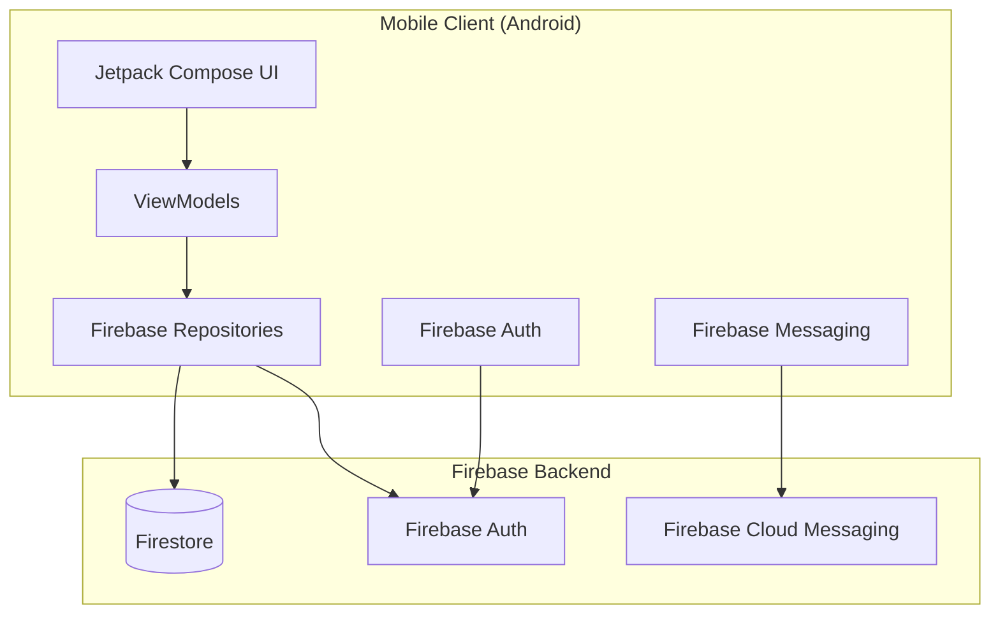
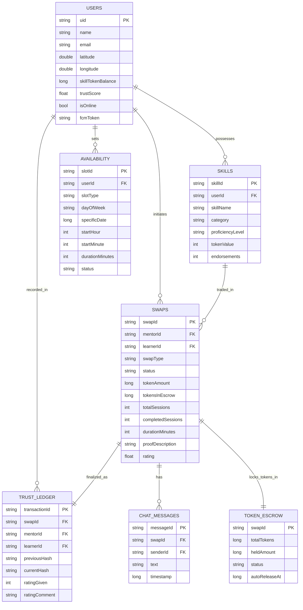

# 🌟 KnowItAll: P2P Skill Trading Platform

### *Bridging the Knowledge Gap, One Trade at a Time.*

KnowItAll is a revolutionary peer-to-peer (P2P) platform designed to empower individuals in semi-urban areas by turning their skills into a currency. Whether you're a coder wanting to learn pottery, or a carpenter looking for English lessons, KnowItAll facilitates hyper-local skill exchanges within a **5km radius** using a unique **Hybrid Barter & Token System**.

---

## 📖 Table of Contents
1. [🌟 Mission & Vision](#-mission--vision)
2. [🛤 How It Works (User Journey)](#-how-it-works-user-journey)
3. [💎 The Hybrid Economy (Tokenomics)](#-the-hybrid-economy-tokenomics)
4. [🔒 Trust & Security (The Ledger)](#-trust--security-the-ledger)
5. [📜 The Skill Passport](#-the-skill-passport)
6. [📱 App Walkthrough](#-app-walkthrough)
7. [🗓 Availability Calendar](#-availability-calendar)
8. [🔔 Push Notifications](#-push-notifications)
9. [📡 Skill Feed & Discovery](#-skill-feed--discovery)
10. [🏗 System Architecture](#-system-architecture)
11. [🛠 Tech Stack](#-tech-stack)
12. [🚀 Getting Started](#-getting-started)
13. [❓ FAQ](#-faq)

---

## 🌟 Mission & Vision

In many communities, valuable skills go untapped because there is no formal marketplace for them. **KnowItAll** aims to:
- **Monetize Time**: Allow users to "earn" by teaching others.
- **Democratize Learning**: Make education accessible without traditional monetary barriers.
- **Build Trust**: Use technology to create verifiable, immutable records of skill proficiency.

---

## 🛤 How It Works (User Journey)

### 1. **Discover (Skill Feed + Skill Radar)**
Open the **Skill Feed** to see new skills added nearby, recently completed swaps, top-rated mentors, and trending categories. Switch to the **Skill Radar** for a real-time OSMDroid map of mentors within 5km. Filter by online status or skill categories.

### 2. **Connect & Request**
Found someone who teaches what you need? Tap their map pin → view their profile → tap **Connect & Request Swap**. Choose:
- **Barter Trade**: "I'll teach you Python if you teach me Guitar."
- **Token Trade**: "I'll pay you 50 SkillTokens for a 1-hour Java lesson."
- **Hybrid Trade**: Both tokens and skill exchange.

For TOKEN and HYBRID swaps, select the number of sessions and duration. Pick a time slot from the mentor's **Availability Calendar** if they've set one.

### 3. **The Session**
Once accepted:
- **Online (TOKEN/HYBRID)**: Use the built-in **Chat** to coordinate, then launch a **Jitsi Meet video call** with one tap. After each session, mark it complete and track progress.
- **In-Person (BARTER)**: Meet up, then both open the **QR Handshake** screen. Each user generates a signed QR code. Scan each other's — when both sides verify, the session is marked complete automatically.

### 4. **Proof & Rating**
For TOKEN/HYBRID swaps, submit a **proof of completion** (description + actual duration) before finalising. Then rate the mentor:

| Rating | Tokens to Mentor | Tokens Held in Escrow |
|--------|------------------|-----------------------|
| ⭐⭐⭐⭐⭐ | 100% | 0% |
| ⭐⭐⭐⭐ | 75% | 25% (7-day hold) |
| ⭐⭐⭐ | 50% | 50% (7-day hold) |
| ⭐⭐ or below | 25% | 75% (7-day hold) |

Held tokens auto-release to the mentor after 7 days if no dispute is raised.

### 5. **Finalize & Review**
The **Trust Ledger** records every transaction using SHA-256 hash chaining. Both parties' Trust Scores update automatically. Generate a verified **Skill Passport PDF** from the Vault.

---

## 💎 The Hybrid Economy (Tokenomics)

KnowItAll uses a dual-currency approach to solve the "double coincidence of wants":

- **Direct Barter (1:1)**: You have what I want, I have what you want. We swap directly — verified via QR handshake.
- **SkillTokens**:
  - **Earn**: By teaching skills, with tokens released based on learner rating.
  - **Spend**: Use earned tokens to buy lessons from any mentor.
  - **Escrow**: Tokens are locked when a swap is accepted and released only after rating — protecting both parties.
  - **Partial Hold**: Low ratings hold a portion of tokens in escrow for 7 days, giving learners a dispute window.

---

## 🔒 Trust & Security (The Ledger)

Every trade on KnowItAll is backed by a **Blockchain-Inspired Trust Ledger**:

- **SHA-256 Hashing**: Each transaction is cryptographically hashed with the previous hash included, making history tamper-proof.
- **Dual Verification**: Trades only finalise when both parties complete the QR handshake or video session.
- **Proof of Completion**: For online sessions, users must submit a written description of what was covered and the actual session duration before tokens are released.
- **Trust Score**: A dynamic score based on ratings, endorsements, and swap history. High scores unlock better Skill Passport ratings.

---

## 📜 The Skill Passport

Your profile is a **Skill Passport**:
- **Micro-credentials**: Every skill you learn or teach is recorded.
- **Verified History**: Backed by real transaction hashes from the Trust Ledger.
- **PDF Export**: Generate an official verified PDF for job applications or your professional portfolio — directly from the Vault screen.

---

## 📱 App Walkthrough

### Feed (Home)
The default screen after login. Shows:
- 🆕 **New Skills** added by nearby users
- 🤝 **Completed Swaps** from the community (social proof)
- ⭐ **Top Mentors** ranked by trust score with a Connect button
- 🔥 **Trending Categories** (Digital, Physical, Hybrid) with skill counts

### Skill Radar
Interactive map (OpenStreetMap — no API key needed) showing nearby mentors as initials pins. Green dot = online. Tap a pin → view profile → Connect & Request Swap.

### Trade Center
Manage all swaps. Tabs: **Active** and **History**.

Active swap cards show role-aware actions:
- **Mentor** on REQUESTED swap: Accept / Decline
- **Learner** on REQUESTED swap: Cancel
- **Both** on ACTIVE swap: Chat · Video Call (TOKEN/HYBRID) or QR Verify (BARTER) · Mark Session Done · Cancel
- **Completed** swap (learner): Rate & Release Tokens

### The Vault
- SkillToken balance (large editorial display)
- Trust score, completed swap count, average rating
- Full Trust Ledger timeline with hash preview
- Generate Skill Passport PDF

### Skill Profile
- Profile header with initials avatar
- All your skills with category colour coding, proficiency, token value, endorsements
- Add / delete skills
- **Set Availability** — manage your teaching schedule

---

## 🗓 Availability Calendar

Mentors set when they're available to teach. Two slot types:

- **Recurring**: Repeats every week on the same day and time (e.g. every Monday 6–8 PM)
- **One-off**: A specific date and time, once only (e.g. 15 June 3–5 PM)

**Mentor flow**: Skill Profile → Set Availability → Add Recurring or One-off slot → pick day/date, start time, duration.

**Learner flow**: When requesting a TOKEN or HYBRID swap, a slot picker shows the mentor's available slots. Select one to book it. If the mentor hasn't set availability, you can still send the request and coordinate via chat.

Slots are automatically marked **Booked** when a swap is accepted and released back to **Available** if the swap is cancelled.

---

## 🔔 Push Notifications

Real-time notifications using **Firebase Cloud Messaging (FCM)**:

| Event | Recipient |
|-------|-----------|
| New swap request received | Mentor |
| Swap request accepted | Learner |
| New chat message | Counterpart |
| Tokens released from escrow | Mentor |
| Swap cancelled | Counterpart |
| Session marked complete | Both |

FCM tokens are saved to Firestore on login and refreshed automatically by `KnowItAllMessagingService`. Notifications deep-link directly to the relevant screen.

---

## 📡 Skill Feed & Discovery

A scrollable discovery feed (5th tab in bottom nav) that drives daily engagement:

- **New Skills**: Cards showing recently added skills from nearby users, with their trust score and category colour coding.
- **Completed Swaps**: Community activity showing who taught what, with star ratings.
- **Top Mentors**: Highlighted mentor cards with trust score, swap count, and a direct Connect button.
- **Trending Categories**: Horizontal chip strip showing which skill categories have the most activity (Digital / Physical / Hybrid).

Feed items are interleaved across types so the feed never shows all of one kind at once.

---

## 🏗 System Architecture

### High-Level Component Diagram



### Core Data Collections (Firestore)



---

## 🛠 Tech Stack

### Mobile (Android)
| Layer | Technology |
|-------|-----------|
| UI | Jetpack Compose + Material 3 |
| Architecture | MVVM + Clean Architecture |
| Navigation | Jetpack Navigation Compose |
| Maps | OSMDroid (free, no API key) |
| Video Calls | Jitsi Meet (free, opens browser) |
| QR Codes | ZXing |
| PDF Generation | iText 7 |

### Backend (Firebase — fully serverless)
| Service | Usage |
|---------|-------|
| Firebase Auth | User registration, login, session management |
| Firestore | All data storage, real-time sync |
| Firebase Cloud Messaging | Push notifications |

### Security & Utilities
| Tool | Usage |
|------|-------|
| SHA-256 | Trust ledger hash chaining |
| AES-GCM | Token escrow integrity |
| FCM HTTP v1 API | Client-side push notifications |

---

## 🚀 Getting Started

### Prerequisites
- Android Studio Ladybug or later
- Android SDK 26+
- A Firebase project with Auth and Firestore enabled

### Installation

1. **Clone the repo**:
```bash
git clone https://github.com/kunal-gangani/Knows-It-All.git
```

2. **Firebase setup**:
   - Create a project at [console.firebase.google.com](https://console.firebase.google.com)
   - Enable **Authentication** (Email/Password)
   - Enable **Firestore Database** (start in test mode)
   - Enable **Cloud Messaging**
   - Download `google-services.json` and place it at `app/google-services.json`

3. **Build and run**:
```bash
./gradlew installDebug
```

### Firestore Indexes Required
The app needs one composite index for the nearby users query. When you first open the Radar screen, Firestore will show an error with a direct link to create the index. Click it and wait ~2 minutes.

---

## ❓ FAQ

**Q: Is it free to use?**
A: Yes. Barter trades require no tokens. Tokens are earned by teaching.

**Q: What if someone scams me?**
A: The Trust Ledger records every trade with SHA-256 hashing. For TOKEN swaps, tokens are held in escrow until both parties complete the session and rate each other. Low ratings hold a portion of tokens in escrow for 7 days as a dispute window.

**Q: What happens to held escrow tokens after 7 days?**
A: They auto-release to the mentor if no dispute is raised within the window.

**Q: Why 5km radius?**
A: We focus on building real-world local communities. 5km is ideal for in-person trades while offering a wide variety of skills.

**Q: Do I need a Google Maps API key?**
A: No. The Radar screen uses OpenStreetMap via OSMDroid — completely free with no API key or billing required.

**Q: How do video calls work?**
A: Tapping **Video Call** on an active swap opens a Jitsi Meet room unique to that swap. Both users tap the same button and land in the same room. No account or app install needed — works in the browser.

---

© 2025 KnowItAll — Empowering Peer-to-Peer Learning.