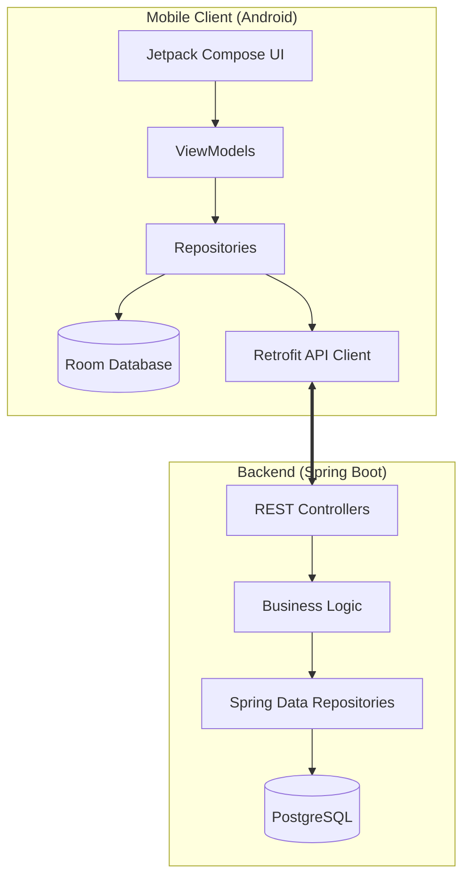
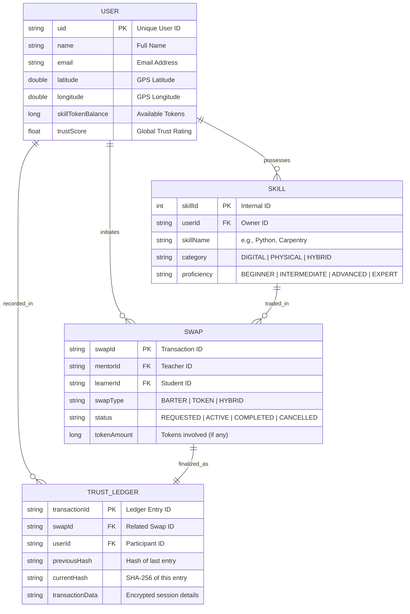

# 🌟 KnowItAll: P2P Skill Trading Platform

### *Bridging the Knowledge Gap, One Trade at a Time.*

KnowItAll is a revolutionary peer-to-peer (P2P) platform designed to empower individuals in semi-urban areas by turning their skills into a currency. Whether you're a coder wanting to learn pottery, or a carpenter looking for English lessons, KnowItAll facilitates hyper-local skill exchanges within a **5km radius** using a unique **Hybrid Barter & Token System**.

---

## 📖 Table of Contents
1. [🌟 Mission & Vision](#-mission--vision)
2. [🛤 How It Works (User Journey)](#-how-it-works-user-journey)
3. [💎 The Hybrid Economy (Tokenomics)](#-the-hybrid-economy-tokenomics)
4. [🔒 Trust & Security (The Ledger)](#-trust--security-the-ledger)
5. [📜 The Skill Passport](#-the-skill-passport)
6. [📱 App Walkthrough](#-app-walkthrough)
7. [🏗 System Architecture (UML)](#-system-architecture-uml)
8. [🛠 Tech Stack](#-tech-stack)
9. [🚀 Getting Started](#-getting-started)
10. [❓ FAQ](#-faq)

---

## 🌟 Mission & Vision

In many communities, valuable skills go untapped because there is no formal marketplace for them. **KnowItAll** aims to:
- **Monetize Time**: Allow users to "earn" by teaching others.
- **Democratize Learning**: Make education accessible without traditional monetary barriers.
- **Build Trust**: Use technology to create verifiable, immutable records of skill proficiency.

---

## 🛤 How It Works (User Journey)

### 1. **Discover (Skill Radar)**
Open the **Skill Radar** to see a real-time map of mentors and learners within 5km. Filter by skill categories like *Digital*, *Physical*, or *Hybrid*.

### 2. **Connect & Request**
Found someone who teaches what you need? Send a **Swap Request**. You can propose a:
- **Barter Trade**: "I'll teach you Python if you teach me Guitar."
- **Token Trade**: "I'll pay you 50 SkillTokens for a 1-hour Java lesson."

### 3. **The Handshake (Verification)**
Once the session happens, verify it:
- **In-Person**: Scan each other's **QR Handshake** code.
- **Remote**: Use the built-in **Video Call** interface.

### 4. **Finalize & Review**
After the session, the **Trust Ledger** records the transaction. Both parties rate each other, contributing to their global **Trust Score**.

---

## 💎 The Hybrid Economy (Tokenomics)

KnowItAll doesn't just rely on direct bartering. We use a dual-currency approach to solve the "double coincidence of wants":

- **Direct Barter (1:1)**: You have what I want, and I have what you want. We swap directly!
- **SkillTokens**: 
  - **Earn**: By teaching a skill to someone who might not have a skill you want.
  - **Spend**: Use earned tokens to "buy" lessons from any mentor on the platform.
  - **Escrow**: Tokens are held safely by the platform during an active swap and released only upon successful verification.

---

## 🔒 Trust & Security (The Ledger)

We take trust seriously. Every single trade on KnowItAll is backed by a **Blockchain-Inspired Trust Ledger**.

- **SHA-256 Hashing**: Every transaction is cryptographically hashed. Each new block contains the hash of the previous one, making the history tamper-proof.
- **Dual Verification**: Trades only finalize when both parties "handshake" via QR or Video.
- **Trust Score**: A dynamic score based on transaction history, endorsements, and successful swaps. High scores unlock better "Skill Passport" ratings.

---

## 📜 The Skill Passport

Your profile isn't just a bio—it's a **Skill Passport**.
- **Micro-credentials**: Every skill you learn or teach is recorded.
- **Verified History**: Unlike a regular resume, your Skill Passport is backed by real transaction hashes on the ledger.
- **PDF Export**: Generate an official, verified PDF of your skills and trust score to use for job applications or your professional portfolio.

---

## 📱 App Walkthrough

- **Login/Register**: Secure JWT-based authentication.
- **Skill Radar**: An interactive map showing users near you.
- **Trade Center**: Manage your active swaps, pending requests, and trade history.
- **The Vault**: View your SkillToken balance and detailed trust ledger entries.
- **Profile**: Customize your offered skills and view your digital Skill Passport.

---

## 🏗 System Architecture (UML)

### High-Level Component Diagram
Understand how the Android app communicates with our Spring Boot backend.



### Core Data Entities (ER Diagram)
The backbone of our data management system.



---

## 🛠 Tech Stack

- **Mobile (Frontend)**: 
  - Jetpack Compose (Modern UI)
  - Room DB (Offline first)
  - Retrofit (Networking)
  - Fused Location API (GPS Radar)
- **Backend**: 
  - Spring Boot 3 (Java 17)
  - Spring Security + JWT (Auth)
  - PostgreSQL (Persistent storage)
- **Security & Utilities**:
  - SHA-256 (Hashing)
  - iText 7 (PDF Generation)
  - ZXing (QR Code Handshake)

---

## 🚀 Getting Started

### Prerequisites
- **Android**: Android Studio Jellyfish+, SDK 24+.
- **Backend**: Java 17+, Maven 3.8+, PostgreSQL.

### Installation
1. **Clone the Repo**:
   ```bash
   git clone https://github.com/your-repo/KnowItAll.git
   ```
2. **Setup Backend**:
   - Configure `application.yml` with your PostgreSQL credentials.
   - Run `mvn spring-boot:run`.
3. **Setup Android**:
   - Update `BASE_URL` in `RetrofitClient.kt` to point to your server IP.
   - Build and run the app.

---

## ❓ FAQ

**Q: Is it free to use?**
A: Yes! You can trade skills directly via barter without ever using tokens.

**Q: What if someone scams me?**
A: Our Trust Ledger and SHA-256 hashing ensure all trades are recorded. If a session is disputed, our support team uses the ledger history to resolve it. Always use the QR Handshake or Video Call verification to protect your tokens.

**Q: Why 5km radius?**
A: We focus on building real-world communities. 5km is the perfect distance for in-person trades while still offering a wide variety of skills.

---
© 2024 KnowItAll - Empowering Peer-to-Peer Learning.
